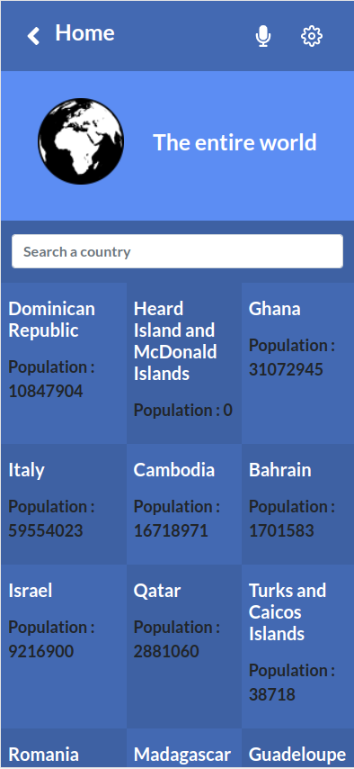

# The Entire World

## Built With

- React (CRA)
- React Router Dom
- Redux Toolkit
- Bootstrap

## sneak peeks

  || 

## Getting Started

**Prerequisites:** A Web Browser (preferably FireFox or Chrome)
To get a local copy up and running follow these simple exampl

#### Live demo

[The Entire World Website](http://ridwanediallo.github.io/The-Countries)

#### Capston project video

[Video Link](https://youtu.be/_oDtvPwq8io)

### **Option 2**

#### Set up your own copy locally

- Clone [the GitHub Repository](https://github.com/ridwanediallo/The-Countries.git)
- Go to the Project `cd "The-Countries"`
- Run `npm install` to install the _dependencies_
- Run `npm start` to run the live server.
- Run `npm test` to run the tests

## About me

👤 **Ridwan**

- GitHub: [@githubridwan](https://github.com/ridwanediallo)
- Twitter: [@twitterridwan](https://twitter.com/RidwaneD)
- LinkedIn: [LinkedIn](https://www.linkedin.com/in/ridwan-diallo)

## Credits

Thanks for [Nelson Sakwa](https://www.behance.net/sakwadesignstudio) for the time and effort to make UI design.

## Contributors

Contributions, issues, and feature requests are welcome!

Feel free to check the [issues page](../../issues/).

## Show your support

Give a ⭐️ if you like this project!

## 📝 License

This project is under the [MIT](LICENSE) license.
